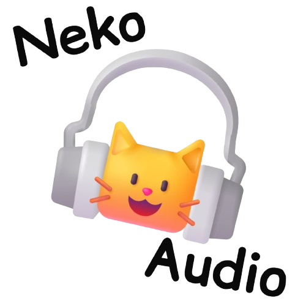

# 🎧 NekoAudio
A simple cat-like DAW in web.

> v2.0.1

<div align="center">
  
</div>

A professional-grade Digital Audio Workstation (DAW) built with Web Audio API. Load audio, apply real-time effects, arrange clips on a timeline, and export your mix.

## ✨ Features

### Core
- **Multi-track support** - Add unlimited tracks, each with independent audio
- **Timeline arrangement** - Drag, drop, and arrange audio clips visually
- **Real-time effects** - 30+ effects including distortion, reverb, delay, filters, modulation, and spatial audio
- **Export** - WAV and MP3 export with effect processing
- **Preset system** - Save and load effect presets, export/import JSON sessions

### Effects Library
| Category | Effects |
|----------|---------|
| TIME | Speed, Pitch, Reverb, Delay, Feedback, Reverse |
| FILTERS | Low-pass, High-pass, Band-pass, Notch, Resonance |
| DESTROY | Distortion, Bitcrush, Ring Mod, Noise Gate, Downsample, Tape Stop |
| MODULATION | Chorus, Flanger, Phaser, Tremolo, Vibrato, Auto-pan |
| SPECTRAL | Stutter, Robot Voice, Compressor, Stereo Width, Normalize |
| SPATIAL | 3D Position (X/Y/Z), Room Size, Motion Paths |

## 🚀 Live Demo

[NekoAudio Live](https://sides.catsdevs.online/NekoAudio/)

## 📦 Installation

```
git clone https://github.com/justchrisdevmeow/NekoAudio.git
cd NekoAudio
```

Then serve with any static server and navigate to `/app/`:
```
npx serve .
# then open http://localhost:3000/app/
```

## 🎮 Usage

1. Navigate to `/app/` in your browser
2. **Load audio** - Drag & drop or click browse button
3. **Select target** - Choose Master or specific track from dropdown
4. **Apply effects** - Open Effects drawer (🎛️ EFFECTS) and adjust parameters
5. **Multi-track** - Click ➕ TRACK to add tracks, load different audio to each
6. **Arrange** - Drag clips on timeline to position them
7. **Export** - Click 💿 EXPORT, choose format (WAV/MP3)

### Keyboard Shortcuts

| Key | Action |
|-----|--------|
| Space | Play/Pause |
| S | Stop |
| L | Toggle Loop |
| T | Add Track |
| ← → | Seek -5/+5 seconds |
| ↑ ↓ | Master Volume |
| Ctrl+S | Save Preset |

## 🏗️ Project Structure

```
NekoAudio/
├── index.html                    # Homepage (landing page)
├── app/
│   ├── index.html                # Main DAW application
│   ├── assets/
│   │   ├── images/
│   │   │   ├── PawPointer.png
│   │   │   ├── PawHand.png
|   |   |   ├── PawHandCursor.png       
|   |   |   └── PawPointerCursor.png       # NekoAudio only uses this for now
│   │   └── sounds/
│   │       ├── meow1.mp3
│   │       ├── meow2.mp3
│   │       └── meow3.mp3
│   ├── css/
│   │   └── styles.css
│   └── js/
│       ├── main.js
│       ├── meow.js               # Meow sound effects
│       ├── audio-engine.js
│       ├── track.js
│       ├── track-manager.js
│       ├── timeline.js
│       ├── clip.js
│       ├── effects.js
│       ├── presets.js
│       ├── ui.js
│       ├── meter-component.js
│       ├── export-range.js
│       ├── drag-drop-handler.js
│       └── time-stretch.js
└── README.md    # the file your reading rn
```

## 🛠️ Built With

- Web Audio API
- HTML5 Canvas (waveforms & timeline)
- lamejs (MP3 encoding)
- ES Modules

## 📝 License

MIT

## 🙏 Acknowledgments

- Inspired by modern DAWs like Ableton Live and FL Studio

---

Made with 🎧 by justdev-chris/justchrisdevmeow
